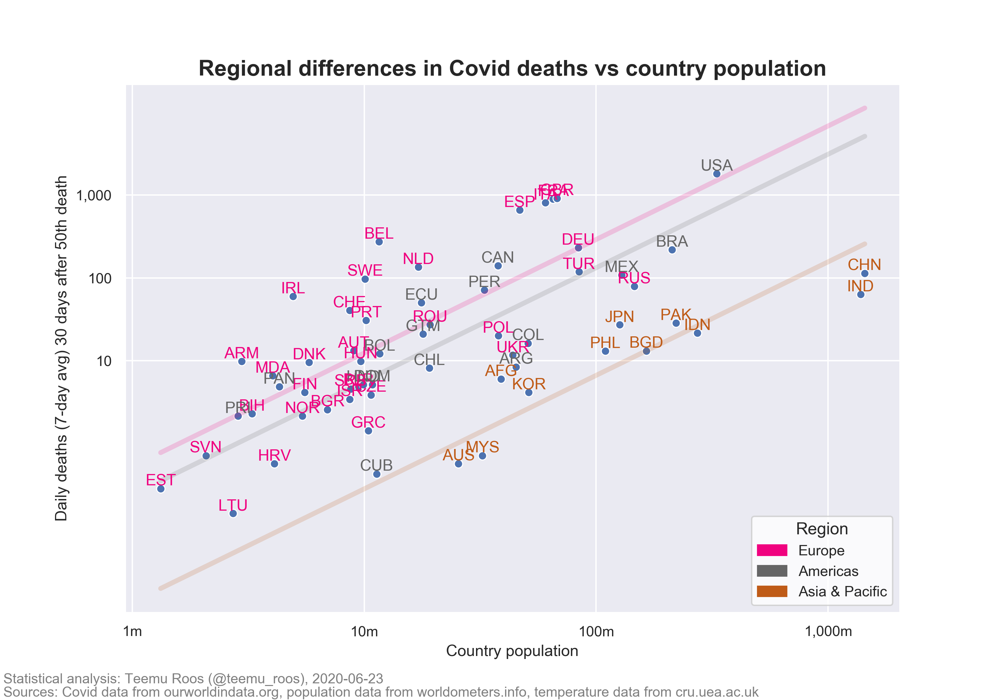

# covid-vis
Simple visualization of COVID deaths in different regions

This started from John Burn-Murdoch's chart that showed that country population and Covid deaths are weakly correlated.

For an explanation of the analysis, see https://twitter.com/teemu_roos/status/1254727507833741312?s=20

Model | R-squared
------|----------
population | 0.377
population & region | 0.647
population & region & Feb temp. | 0.648
population & region & pop-density | 0.657
population & region & pop-density & Feb temp. | 0.660

### Example chart: No temperatures or population density, R-squared 0.647

